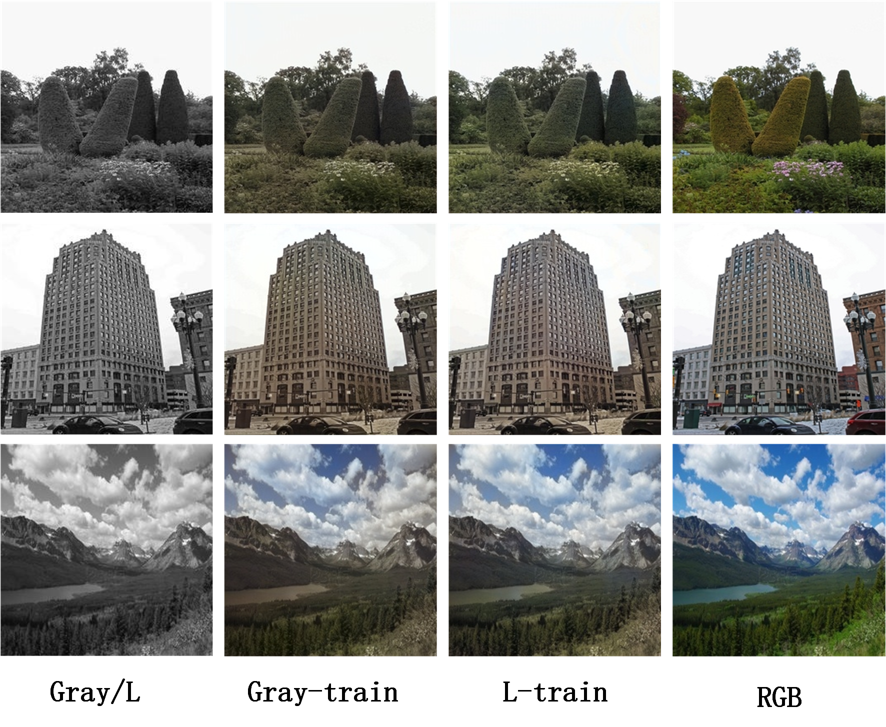

# Automatic Image Colorization  
>In the image colorization task, our goal is to generate color image with given gray input image. This problem is challenging because a single gray-scale image may correspond to many reasonable color images. Therefore, the traditional model usually depends on the important user input and the gray image content.
Recently, deep convolutional neural networks has achieved remarkable success in automatic image colorization: from gray to color without additional manual input. Part of the reason for this success lies in the ability of deep neural network to capture and useful semantic information (i.e. the actual content of images). Although it is not clear why these types of models perform so well at present, because deep learning is similar to black box, it is unable to figure out how the algorithm automatically learns for the time being, and it will develop towards the direction of interpretability research in the future.

## Dependencies
+ pytorch (1.4.0)
+ python (3.5.0)
+ cudatoolkit(10.0)
+ torchvision (0.2.0)
+ tensorboard (1.6.0)
+ pillow
+ matplotlib
+ skimage

## ColorNet  
I provide you how to do image colorization task in two ways.  

Two different approaches are shown in the picture above. The core idea of both algorithms needs to use `Lab` color representation mode. The `L` component in the `Lab` color space is used to represent the brightness of pixels. The value range is [0-100], which means from pure black to pure white; `a` means the color representation from red to green, which ranges of [127, -128]; `b` means the color representation from yellow to blue, which ranges of [127, -128]. `RGB` is a device related color space. `Lab` mode is neither light dependent nor pigment dependent. It is not only a device independent color system, but also a color system based on physiological characteristics. This means that `Lab` color space is a digital way to describe human visual perception.  
  
The algorithm flow of this paper firstly needs to transform `rgb` into `Lab` color space, then we need to separate the `L` and `ab` channels. 
The `L` are taken as training data and `ab`	is GT. In flow chart 1, we use `gray` scale images to represent `L` approximately and use it as training data. The cnn model architecture used in this work is shown in the figure above which named as `ColorNet`.  

## Results  
The RGB used in this work is from **[MIT-place](http://places.csail.mit.edu/)**. We used one of the sub-datasets, include Outdoor scenery, buildings, etc. The training dataset consists of 40000 images in total, and the test dataset consists of 1000 randomly selected images.
  
Let's give three groups of comparative graphs here in th above picture. From the perspective of human visual effect, the CNN method in this project can color `gray-scale` image to make it have `RGB` color representation. At the same time, the result of the `flow chart 2` method is better than the former.

## Acknowledgement
This work is mainly inspired by **[Automatic Colorization](https://tinyclouds.org/colorize/)**, **[colorful image colorization](https://arxiv.org/pdf/1603.08511.pdf)**, **[Colorize Photos](https://demos.algorithmia.com/colorize-photos)** and **[Instance-aware Image Colorization](https://deepai.org/publication/instance-aware-image-colorization)**.
